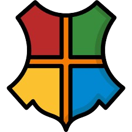

-----

# Hogwarts Game - v. Bêta
Hogwarts Game is a text-based adventure game set in the _Harry Potter_ universe. This project is developed as part of a Python programming project at our school **Efrei Paris**.

_Developed by Aomm-lgtm & GauGoth Corp._

**Caution: This tool is intended for personal use only. Always respect the copyright laws in your country.**

## How to play
**_This game is still in development. This part will be updated as soon as possible._**
<!--
## Download it!

**You can download the latest version of Auto Medias Downloader here: 
[[Auto-Medias-Downloader-v1.3.zip](https://galaxielointaine.alwaysdata.net/others/Auto-Medias-Downloader-v1.3.zip)]. The installation process is automatic and included in the program.**

**Looking for the full documentation? Read the DOCUMENTATION.md file:
[[DOCUMENTATION.md](DOCUMENTATION.md)]**

## More help

- For more information about yt-dlp, visit the official yt-dlp documentation: [Documentation](https://github.com/yt-dlp/yt-dlp#installation).
-->

## License
_Copyright © 2025 GauGoth Corp. All rights reserved._

_Copyright © & TM Warner Bros. Entertainment Inc. Publishing Rights © J.K. Rowling_

The Hogwarts Game is, in no way, affiliated with, endorsed, sponsored, or specifically approved by Warner Bros. Entertainment Inc., J.K. Rowling, or any of their respective affiliates or subsidiaries. All trademarks, service marks, and trade names are the property of their respective owners.

**You can read the License in the LICENSE.md file:
[[LICENSE.md](LICENSE.md)]**

## About us
Visit our GitHub profiles or the GauGoth Corp. website to discover our projects: 
- [Aomm-lgtm](https://github.com/Aomm-lgtm)
- [GauGoth Corp.](http://gaugoth.corp.free.fr/)
- [GauGoth Corp. on GitHub](https://github.com/GauGoth-Corp)

## Contact
If you have any questions or feedback, feel free to contact us. We are always happy to answer! [Contact Us](http://gaugoth.corp.free.fr/en/credits/contact/?subject=Hogwarts%20Game%20v.%20Beta%20question/feedback).