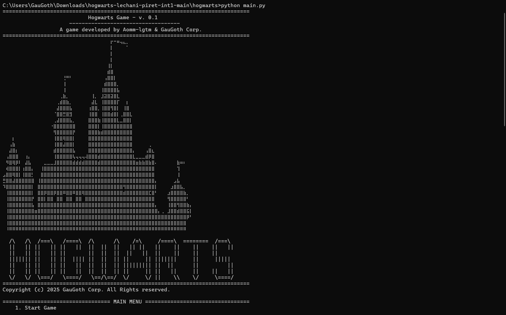
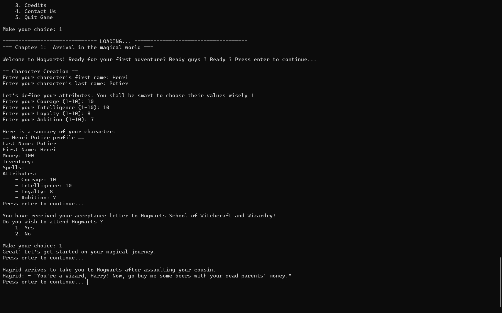
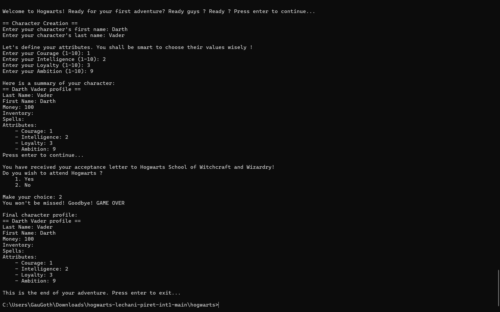
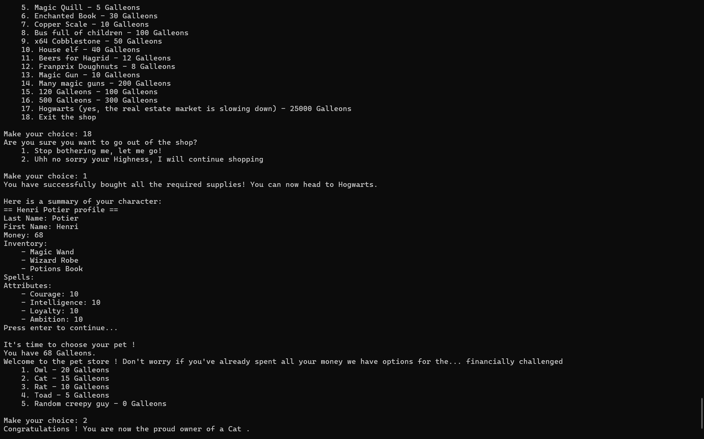
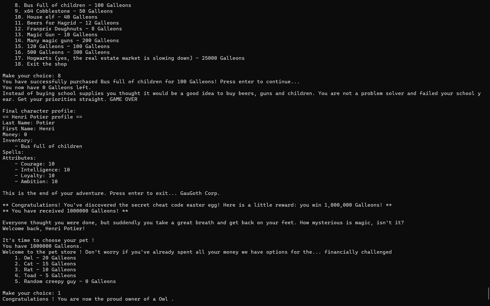
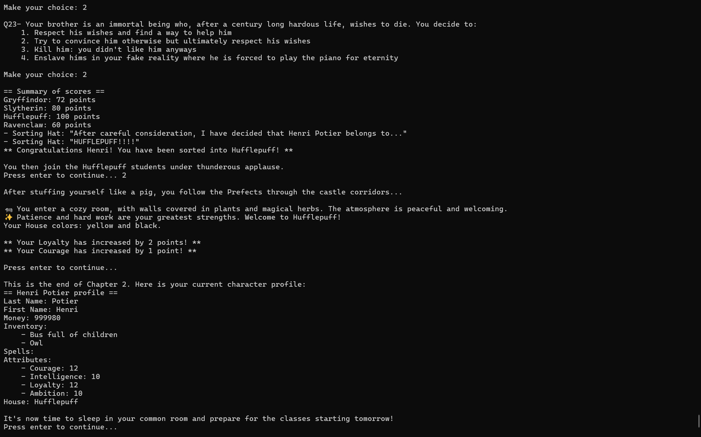
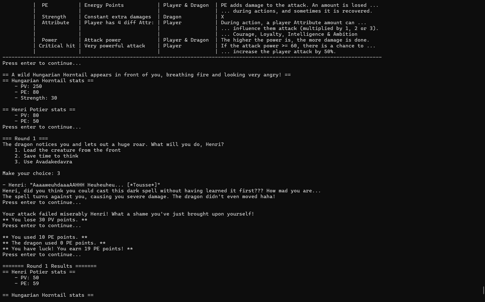
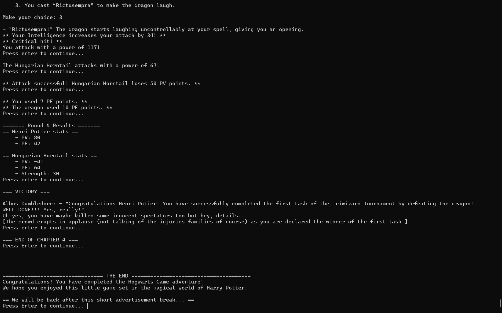
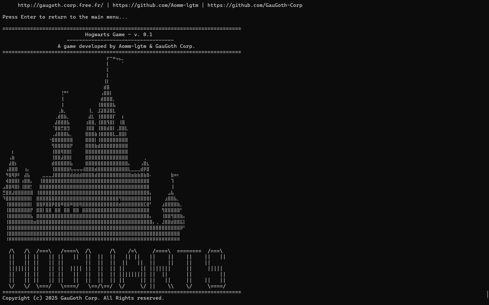

# Hogwarts Game - v. 0.1
<i>Version 0.1 
**Testing file** 
01/01/2026</i>

*********************************************************************

Thank you for downloading Hogwarts Game (v. 0.1).

-----------------------------
Hogwarts Game is a text-based adventure game set in the Harry Potter universe.
To learn more about the game and how to play it, please refer to the [[README.md](README.md)] file.

## Control, Testing & Validation Summary

### Input & Error Management
- All inputs the player is asked to provide are managed in the `input_utils.py` module. This allows to avoid every crashes due to invalid inputs.
- Input types are handled using try/except blocks to avoid crashes ('invalid type!')
- Invalid integer inputs are used to re-prompt the player until a valid input is provided ('more', 'less')
- Empty strings are not accepted

### Known Bugs
- No known bugs at the moment. If you find one, please [contact us](http://gaugoth.corp.free.fr/en/credits/contact/?subject=Hogwarts%20Game%20v.%200.1%20bug%20report).
- In some rare cases, if the game have been missed installed, some `.json` files containing important data may not be found. In this case, an error message is displayed using a try/except block. Please then re-install properly the game following the instructions in the [[README.md](README.md#installation)] file.

### Testing Strategies
- Each module was tested separately during game development (section `if __name__ == "__main__":` at the end of each module and file `__debug__.py`). 
- Numerous games were played, each time making different choices to test the various paths and identify any bugs.

### Screenshots
Here are some screenshots of the game during testing:

_Game Menu screen_

_Character Creation screen - the attributes are well stored_

_Character Creation screen - other choices lead to different outcomes_

_Shop screen - supplies are well bought and stored in the inventory_

_Shop screen - other choices lead to different outcomes! :)_

_House selection screen - the sorting hat works well_

_Dragon fight - round 1: the spells you have already learned influence the fight!_

_The End screen - the adventure is completed successfully_

_Restart Game screen - the player can choose to restart the game. The previous game data is successfully cleared_